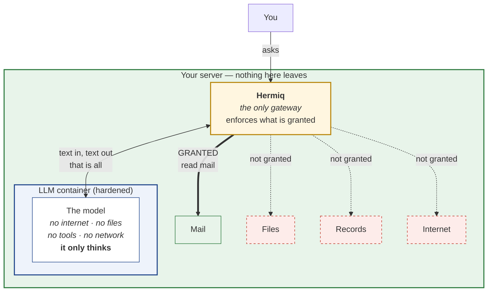
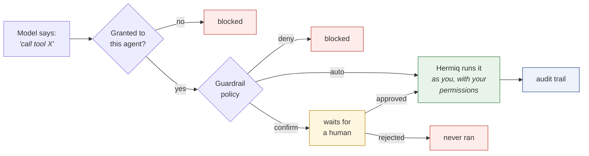

# The safe setup

Start with the question everybody actually has:

> **"What if I want an assistant that summarises my mailbox every morning — but
> can't read my files, and can't delete my mail?"**

That sentence is the whole design. This page explains how Hermiq answers it.

## The idea: the model is a brain in a jar

Most AI products work by uploading. Your documents go to someone else's platform,
their model reads them there, and you hope the terms of service mean what you
think they mean.

Hermiq inverts it, and then goes one step further:

1. **The model runs in a container on your own hardware.** Your data never
   leaves.
2. **That container has no outside access — and doesn't need any.** It is not
   allowed to reach the internet, your files, your records, or any tool. It has
   no hands.
3. **Hermiq has the hands.** Every file read, every record lookup, every internet
   fetch, every tool call goes through the Hermiq layer — which does it *as you*,
   and only if you granted it.

So the model is a brain in a jar. It is very good at thinking, and it can do
nothing on its own. Hermiq hands it text and takes text back. What it is allowed
to see and do is a decision you make, outside the model, where the model cannot
touch it.

That is why "summarise my mail but never touch my files" is a sentence you can
actually enforce here, rather than a hope you write into a prompt.

## The picture

This is the mailbox assistant, drawn. It reads mail because you granted that. It
cannot read files, touch records, or reach the internet — not because it was
asked nicely, but because those paths do not exist for it.

## Why the model can't just go around it

Two independent reasons, and they matter separately:

**It has no network.** The container is hardened: it runs as a non-root user, it
is stateless, and an optional in-container **egress jail** installs an `iptables`
allowlist that DROPs all outbound traffic before dropping privileges. If
something inside tried to call out, the kernel discards the packet. You are not
trusting the software to behave — it *cannot* misbehave.

**It has no tools.** Access is not something the model possesses; it is something
Hermiq performs. The model can only emit text saying *"I would like to read
file X"*. Hermiq reads that request, checks it against the grant list, and either
does it as you — with your permissions — or refuses. A model cannot grant itself
a tool any more than a request can grant itself approval.

This is the difference between an assistant that *promises* not to read your
files, and one that *cannot*.

## Building the mailbox assistant

Concretely, that opening question becomes:

| What you want | How you get it |
|---|---|
| Summarises my mailbox | Grant the mail-read [tool](./tools-and-mcp.md). |
| Every morning | Attach a [schedule](./runs-and-schedules.md) — 07:00 on weekdays. |
| Can't read my files | Don't grant any file tool. Leave [RAG](./rag.md)'s "include files" off. |
| Can't delete my mail | Don't grant a delete tool. If a delete tool exists, classify it **deny** in the guardrail policy. |
| Tell me, don't surprise me | Output is delivered to a Nextcloud Talk conversation. |
| And if it ever tries something big | Classify risky tools **confirm** so they wait for an [approval](../approvals.md). |

Nothing in that list is a prompt instruction. Every one is a configuration the
model cannot see or change.

## Where the model runs

The brain-in-a-jar story is strongest when the jar is yours. You have three
options:

| Path | Where it runs | Does your text leave? |
|---|---|---|
| **Local (Ollama)** | A container on your hardware | **No. Never.** |
| **CLI sidecar (llm-runner)** | A hardened container you run, driving a vendor CLI | Only to hosts you allowlisted |
| **Cloud API** | Someone else's datacentre | Yes |

**Local is the point of all this.** Ollama runs a model like Llama or Qwen next
to Nextcloud. For summarising, sorting, drafting and triage — which is most real
agent work, including our mailbox example — a local model is very often good
enough, and your mail never touches a network you do not own.

The **CLI sidecar** exists for a narrower case: using a subscription (like Claude
Max) the way its vendor intends, by running the CLI they ship. Hermiq is a PHP
app and cannot host a CLI, so it POSTs an assembled turn to a container that can.
That container is stateless and can be egress-jailed to the provider's hosts
only.

**Cloud** is the most capable and least private. A legitimate choice for
non-sensitive work — just a deliberate one. An administrator can set a **model
policy** so agents may only use approved models; an agent asking for one outside
it is moved to an allowed model rather than quietly doing what you did not
sanction.

## Secrets are never in the app

An API key or subscription token is not stored in Hermiq, and not in your agent's
configuration.

Secrets live in a **credential broker**. Hermiq holds only a reference, and the
real token is released **only for the caller, only while a turn is running**.
Your personal credential resolves before your organisation's, which resolves
before the instance default.

The practical consequence: reading your agent's config, exporting it, or
publishing it to the [Store](./skills.md) leaks no secret — there is none in it.

## The layers, in order

1. **Tools are granted, not assumed.** Enforced when the turn is assembled. Grant
   nothing and it can do nothing — that is the default.
2. **Guardrails filter both directions.** Per organisation: redact or block PII
   and secrets, block prompt-injection attempts, on input *and* output. Your
   message and the assembled [context](./context.md) bundle are filtered
   *separately*, so the trace tells an operator which one tripped — "the user
   tried to jailbreak this agent" and "an attached document contains the phrase"
   want opposite responses. Two limits worth knowing: filtering is **off by
   default** (it is a policy you enable), and the [RAG](./rag.md) retrieval block
   is **not** covered today.
3. **Risky tools wait for a person.** Classify `confirm` → every call becomes an
   [approval](../approvals.md).
4. **Everything is recorded.** Every run and tool call lands in OpenRegister's
   audit trail — a governance record, not a log that rotates away.
5. **Nothing exceeds your own access.** Hermiq acts *as you*. An agent cannot
   surface a file you could not open yourself.

## Why this adds up to compliance

None of it was built for a checkbox, but together it answers what the EU AI Act
asks:

| The obligation | What answers it |
|---|---|
| Record-keeping (Art. 12) | Every run, tool call and approval decision, audited |
| Human oversight (Art. 14) | Approval gates and the organisation kill-switch |
| Transparency | The algorithm register and per-feature risk classification |
| Data protection (GDPR) | A local model plus per-run audit trails — the data never left |

When something does go wrong, an **[incident](../incidents.md)** is the human
account, linked to the exact runs and exported alongside the machine record.

## A sensible starting point

1. **Start local.** Ollama in a container. Point an agent at it. It usually gets
   further than expected.
2. **Grant nothing at first.** Add one tool, for the one job.
3. **Classify the dangerous ones `confirm` or `deny`** *before* you attach a
   schedule.
4. **Then decide about cloud** — per agent, under a model policy, not as a
   default.

You can always add capability. You cannot un-send data.

## Related

- **[Tools & MCP](./tools-and-mcp.md)** — the grant list and risk classification.
- **[Approvals](../approvals.md)** — the human gate.
- **[Runs & schedules](./runs-and-schedules.md)** — making it happen every morning.
- **[Agents](./agents.md)** — choosing a provider and model.
